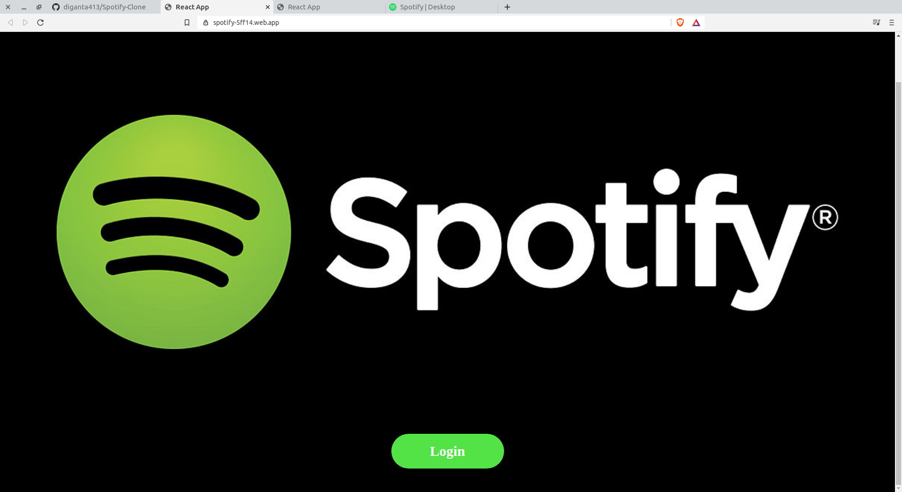
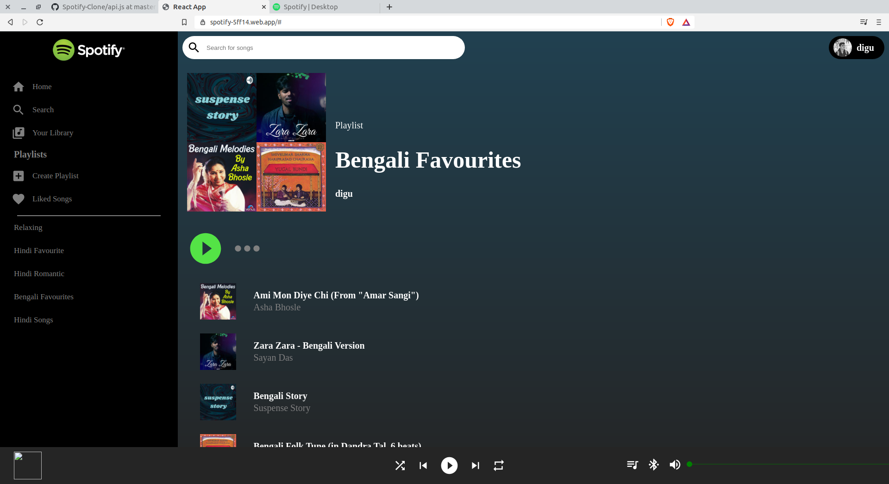

# Spotify Clone
This is a clone of Spotify. It is only the front-end part. It only displays your spotify play list. I have used the spotify api for fetching the songs.
You can check the website in the link given below.....
<a href="https://spotify-5ff14.web.app/" style="display: block;margin-left:40%;font-Size:15px">Go to live app<a/>

## Features

- Spotify Login
- See all the songs in your playlists

## Technologies

- ReactJS
- React Context Api
- Material UI
- Spotify Auth

## Setup

### To setup this project, install it locally using npm

- npm install
- npm start

## Screenshots

### Login Page

### Main Page
